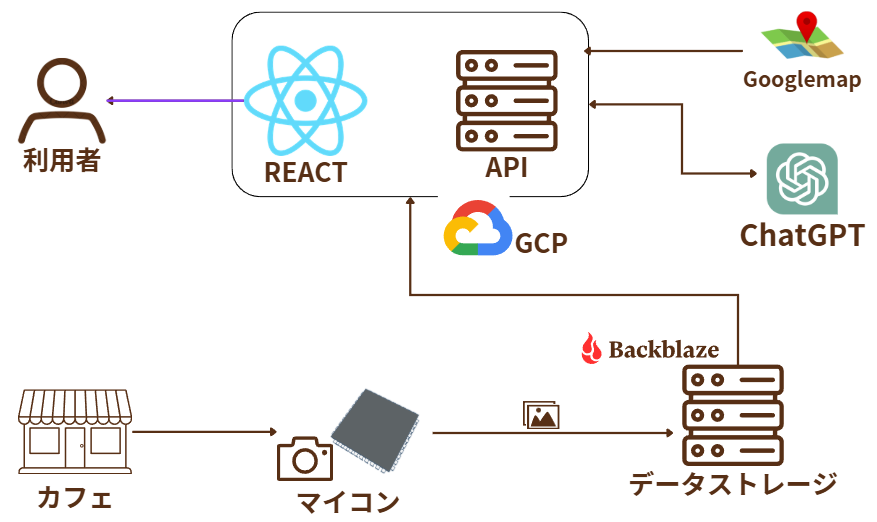

# HotAICafe - パーソナライズ化したカフェ提案アプリ

HotAICafe は、**チャット形式の対話を通じてユーザーの好みを分析し、リアルタイムに取得したカフェの状況をもとに、AI がパーソナライズされた提案を行うアプリケーション**です。

ESP32-S3 搭載センサーによるリアルタイムな空席・混雑状況の取得と、OpenAI ChatGPT API を活用した対話型 AI を組み合わせることで、その時点の状況に適した席・利用方法を提示します。

## アプリ画面

<p align="center">
  
</p>

## 目次

1. [概要](#概要)
2. [主な特徴](#主な特徴)
3. [機能](#機能)
4. [アーキテクチャ](#アーキテクチャ)
5. [リポジトリ構成](#リポジトリ構成)
6. [前提環境](#前提環境)
7. [セットアップ＆インストール](#セットアップインストール)
   1. [ESP32-S3 ファームウェア](#esp32-s3-ファームウェア)
   2. [バックエンドサーバ](#バックエンドサーバ)
   3. [フロントエンドアプリ](#フロントエンドアプリ)
8. [使い方](#使い方)
9. [設定項目](#設定項目)
10. [今後の改善予定](#今後の改善予定)
11. [貢献者](#貢献者)
12. [連絡先](#連絡先)

---

## 概要

HotAICafe は、**OpenAI ChatGPT API と IoT センサーを組み合わせたカフェ向け提案システム**です。

ユーザーはチャット形式で好みや利用目的を伝えるだけで、AI がその内容を理解し、ESP32-S3 センサーからリアルタイムに取得されるカフェ内の空席・混雑状況・利用状態を考慮した提案を返します。

これにより、従来の静的なレコメンドではなく、**「ユーザーの嗜好 × 現在の環境状況」に基づく動的なパーソナライズ提案**を実現します。

### 主な技術スタック

- **ESP32-S3（センサー側）**：顔認証カメラ、超音波センサー
- **バックエンド**：Python + Flask（Google App Engine）
- **フロントエンド**：TypeScript + React
- **AI**：OpenAI ChatGPT API による嗜好分析・提案生成

## 主な特徴

- チャット形式でユーザーの好みや利用意図を自然に取得
- OpenAI ChatGPT API による高度な自然言語理解
- リアルタイム画像・センサーデータに基づく状況理解
- カフェの混雑状況を考慮した AI 応答と提案
- 利用者と店舗スタッフ双方の意思決定を支援

## 機能

- **AI による対話的な提案**
  - OpenAI ChatGPT API を活用した自然言語処理
  - ユーザーの嗜好・目的（静かに作業したい、複数人で利用したい等）を対話から推定
  - センサーデータと組み合わせたコンテキストアウェアな提案
  - 状況に応じた席・利用方法の提案

- **リアルタイム状況取得**
  - ESP32-S3 による空席・混雑状況の検知
  - センサーデータを即時バックエンドへ送信

- **リアルタイム更新**
  - WebSocket を用いたフロントエンドへのライブ反映

- **履歴可視化**
  - 過去の座席利用状況をグラフで確認

- **データエクスポート**
  - 現在値・履歴データの JSON 出力

## アーキテクチャ

<p align="center">
  
</p>

システムは以下の4つの主要コンポーネントで構成されています：

- **ESP32-S3 センサー層**
  - カフェ内の状況をリアルタイムに取得
  - 画像データとセンサーデータを JSON 形式で送信

- **Flask バックエンド API 層**
  - センサーデータの受信・集計・保存
  - OpenAI ChatGPT API との連携
  - WebSocket/HTTP 通信によるフロントエンドへの配信
  - Google App Engine 上で稼働

- **OpenAI ChatGPT API**
  - ユーザーの対話内容を分析
  - センサーデータを考慮した提案生成

- **React フロントエンド層**
  - チャット UI を通じたユーザー入力
  - リアルタイムデータの可視化
  - AI の提案結果を表示

## リポジトリ構成

```
/
├── ESP32-S3/              # センサー用ファームウェア
│   ├── platformio.ini
│   └── src/
│       └── main.cpp
├── BackEnd/               # Flask バックエンド
│   ├── analysis.py
│   ├── requirements.txt
│   └── app.yaml
├── frontend/              # React SPA
│   ├── public/
│   └── src/
├── images/                # README用画像
│   ├── app-overview.png
│   └── architecture.png
├── .gitignore
└── README.md
```

## 前提環境

- **ESP32-S3**：PlatformIO または Arduino IDE
- **Python**：3.8 以上
- **Node.js & npm**：Node.js 14 以上
- **Google Cloud SDK**：App Engine デプロイ用
- **OpenAI API キー**：ChatGPT API 利用のため

## セットアップ＆インストール

### ESP32-S3 ファームウェア

1. `ESP32-S3/` ディレクトリへ移動
2. `src/main.cpp` に Wi-Fi 情報とバックエンド URL を設定
3. ビルドおよびアップロード

```bash
cd ESP32-S3
pio run --target upload
```

### バックエンドサーバ

1. 依存パッケージのインストール

```bash
cd BackEnd
python -m venv venv
source venv/bin/activate  # Windows の場合: venv\Scripts\activate
pip install -r requirements.txt
```

2. 環境変数の設定

```bash
# OpenAI API キーの設定
export OPENAI_API_KEY="your-openai-api-key-here"
```

3. Google App Engine へデプロイ

```bash
gcloud config set project YOUR_PROJECT_ID
gcloud app deploy app.yaml
```

**注意**: `app.yaml` に環境変数を設定する場合:

```yaml
env_variables:
  OPENAI_API_KEY: "your-openai-api-key-here"
```

### フロントエンドアプリ

```bash
cd frontend
npm install
npm start
```

ブラウザで `http://localhost:3000` にアクセスしてください。

## 使い方

1. ESP32-S3 を起動し、カフェ内の状況取得を開始
2. バックエンドでデータ受信を確認
3. ブラウザからフロントエンドへアクセス
4. チャット形式で好みや目的を入力（例: 「静かに作業できる席はありますか？」）
5. AI がリアルタイムのカフェ状況を反映した提案を返答

## 設定項目

- **ESP32-S3** (`main.cpp`)：Wi-Fi 情報、バックエンド URL
- **バックエンド** (`analysis.py`)：ポート・集計設定、OpenAI API キー
- **フロントエンド** (`config.ts`)：API エンドポイント

## 今後の改善予定

- 混雑・満席時のプッシュ通知
- モバイルアプリ化（React Native）
- 利用状況の予測・推薦精度向上
- UI / UX の改善
- 多言語対応
- ユーザー履歴に基づく学習機能

## 貢献者

- 玉城（[@gusuku-oknw](https://github.com/gusuku-oknw)）
- 岡田（[@otake-code](https://github.com/otake-code)）
- 田上
- 立岩

---

Enjoy monitoring & personalized recommendations with HotAICafe! ☕️✨
